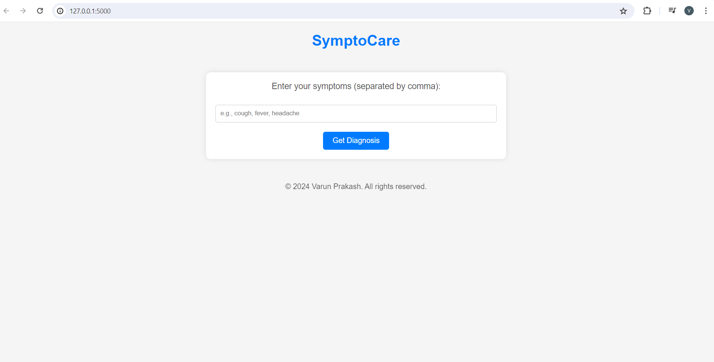
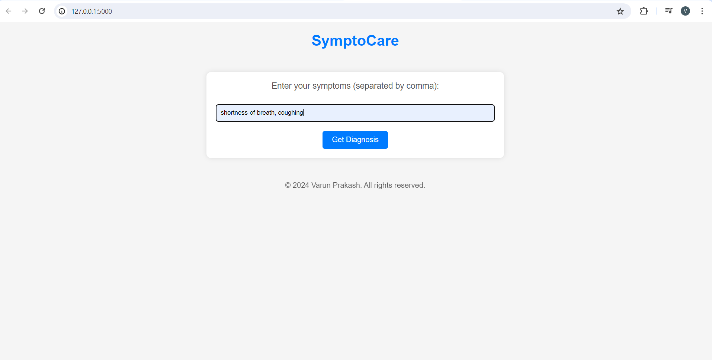
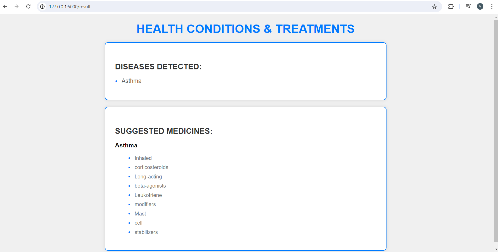

# SymptoCare

SymptoCare is a web application designed to help users diagnose their medical conditions based on entered symptoms and receive suggestions for medicines associated with detected diseases. It aims to provide users with a preliminary understanding of their health concerns and recommend appropriate actions.

## Features

- **Symptom Entry**: Users can input their symptoms, separated by commas, into a text field.
- **Diagnosis**: The application matches the entered symptoms with known diseases and presents the detected diseases to the user.
- **Medicine Suggestions**: For each identified disease, the application offers a list of medicines that may help alleviate symptoms or treat the condition.
- **Responsive Design**: The application is designed to be accessible across various devices, ensuring a seamless user experience.

## Technologies Used

- **Python**: Flask framework powers the backend server, handling user requests and responses.
- **HTML/CSS**: Frontend templates and styling are crafted using HTML and CSS, ensuring a visually appealing and intuitive user interface.
- **JavaScript**: Client-side scripting is implemented using JavaScript to enable dynamic interactions and enhance user experience.
- **Bootstrap**: Bootstrap CSS framework is utilized for responsive design and styling components, ensuring consistency and usability across different screen sizes.
- **Data Management**: Disease information, including symptoms and suggested medicines, is stored and retrieved from text files, simplifying data management and facilitating easy updates.

## Usage

To run SymptoCare locally, follow these steps:

1. Clone the repository:

    ```bash
    git clone https://github.com/RaoVrn/SymptoCare.git
    ```

2. Navigate to the project directory:

    ```bash
    cd SymptoCare
    ```

3. Install dependencies:

    ```bash
    pip install -r requirements.txt
    ```

4. **Troubleshooting Dependencies**:
    If you encounter issues with installing `Werkzeug` or other dependencies, ensure that you have compatible versions of Flask and Werkzeug. Follow these steps to resolve common issues:

    - Update Flask and Werkzeug to the latest compatible versions:
      ```bash
      pip install --upgrade flask werkzeug
      ```

    - If you face a specific error regarding `url_quote`, modify your code to use `quote` instead:
      ```python
      # Change this line in your code:
      from werkzeug.urls import url_quote
      # To this:
      from werkzeug.urls import quote as url_quote
      ```

    - Ensure all dependencies are correctly installed and up-to-date:
      ```bash
      pip install --upgrade -r requirements.txt
      ```

    - If you encounter a dependency conflict error, uninstall the conflicting packages and reinstall them:
      ```bash
      pip uninstall flask werkzeug
      pip install flask werkzeug
      ```

5. Run the Flask application:

    ```bash
    python app.py
    ```

6. Open your web browser and go to `http://localhost:5000` to access SymptoCare.

## Screenshots





## Contribution

Contributions to SymptoCare are welcome! If you have any ideas for improvements, find bugs, or wish to add new features, please feel free to open an issue or submit a pull request. Your contributions help make SymptoCare better for everyone.

## License

SymptoCare is licensed under the [MIT License](LICENSE). You are free to modify and distribute the application as per the terms of the license.
